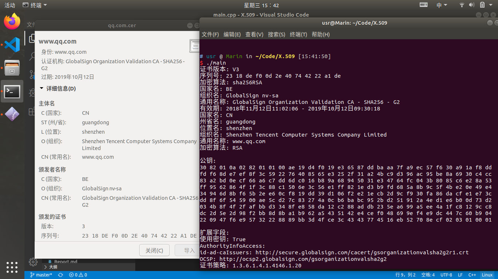

# Assignment 3
- 姓名：张淇
- 学号：17341353
- 邮箱：zhangq295@mail2.sysu.edu.cn

## 一、实验内容
设计并实现一个小程序，读入一个 X.509 数字证书，按照标准定义给出证书中有关项目的中 (英) 文内容陈述。
提交内容包括：
- X.509 证书结构描述
- 数据结构
- C 语言 (可选其它命令式语言)源代码
- 编译运行输出结果
  
## 二、实验原理
### 1. X.509
X.509有多种常用的扩展名，此处介绍的是 DER 二进制格式经过Base64编码后得到的CER格式。证书组成结构标准用ASN.1(一种标准的语言)来进行描述。X.509 v3数字证书结构如下：
- 证书 
  - 版本号：标识证书的版本（版本1、版本2或是版本3）
  - 序列号：标识证书的唯一整数，由证书颁发者分配的本证书的唯一标识符
  - 签名算法：用于签证书的算法标识，由对象标识符加上相关的参数组成，用于说明本证书所用的数字签名算法
  - 颁发者：证书颁发者的可识别名（DN）
  - 证书有效期 ：此日期前无效 - 此日期后无效
  - 主体：证书拥有者的可识别名
  - 主体公钥信息 
    - 公钥算法
    - 主体公钥
  - 颁发者唯一身份信息（可选项）
  - 主体唯一身份信息（可选项）
  - 扩展信息（可选项） 
    - 发行者密钥标识符：证书所含密钥的唯一标识符，用来区分同一证书拥有者的多对密钥
    - 密钥使用：指明（限定）证书的公钥可以完成的功能或服务，如：证书签名、数据加密等
    - CRL分布点
    - 私钥的使用期
    - 证书策略：由对象标识符和限定符组成，这些对象标识符说明证书的颁发和使用策略有关
    - 策略映射
    - 主体别名：指出证书拥有者的别名，如电子邮件地址、IP地址等
    - 颁发者别名：指出证书颁发者的别名
    - 主体目录属性：证书拥有者的一系列属性
- 证书签名算法
- 数字签名

### 2. BASE64
Base64编码本质上是一种将二进制数据转成文本数据的方案。对于非二进制数据，是先将其转换成二进制形式，然后每连续6比特（2的6次方=64）计算其十进制值，根据该值在A--Z,a--z,0--9,+,/ 这64个字符中找到对应的字符，最终得到一个文本字符串。基本规则如下几点：
- 标准Base64只有64个字符（英文大小写、数字和+、/）以及用作后缀等号；
- Base64是把3个字节变成4个可打印字符，所以Base64编码后的字符串一定能被4整除（不算用作后缀的等号）；
- 等号一定用作后缀，且数目一定是0个、1个或2个。这是因为如果原文长度不能被3整除，Base64要在后面添加\0凑齐3n位。为了正确还原，添加了几个\0就加上几个等号。显然添加等号的数目只能是0、1或2；
- 严格来说Base64不能算是一种加密，只能说是编码转换。

## 三、实验过程
### 1. 将BASE64格式的X.509证书进行解码
该格式下的CER文件格式如下：
```
-----BEGIN CERTIFICATE-----
...                         #BASE64格式的正文
-----END CERTIFICATE-----
```
所以在程序中使用`string read_from_file(string filename)`进行从CER文件证书的主体部分的读取，并在`void parseX509(string data) `的前半部分将其从6bits为单位转换成8bits(1byte)为单位的uchar进行存储，并进行后续操作。

### 2. 将经过解码后的证书进行解析
本节内容部分参考了[博客](https://www.cnblogs.com/jiu0821/p/4598352.html)的理论部分内容。

按照标准，解码后的内容使用 ANS.1 表示。
对于X.509证书标准，存在以下的结构：
```
Certificate  ::=  SEQUENCE  {
  tbsCertificate       TBSCertificate,
  signatureAlgorithm   AlgorithmIdentifier,
  signatureValue       BIT STRING  }

TBSCertificate  ::=  SEQUENCE  {
  version         [0]  EXPLICIT Version DEFAULT v1,
  serialNumber         CertificateSerialNumber,
  signature            AlgorithmIdentifier,
  issuer               Name,
  validity             Validity,
  subject              Name,
  subjectPublicKeyInfo SubjectPublicKeyInfo,
  issuerUniqueID  [1]  IMPLICIT UniqueIdentifier OPTIONAL,
												-- If present, version MUST be v2 or v3
	subjectUniqueID [2]  IMPLICIT UniqueIdentifier OPTIONAL,
												-- If present, version MUST be v2 or v3
	extensions      [3]  EXPLICIT Extensions OPTIONAL
												-- If present, version MUST be v3}

Version  ::=  INTEGER  {  v1(0), v2(1), v3(2)  }

CertificateSerialNumber  ::=  INTEGER

Validity ::= SEQUENCE {
  notBefore      Time,
  notAfter       Time }

Time ::= CHOICE {
  utcTime        UTCTime,
  generalTime    GeneralizedTime }

UniqueIdentifier  ::=  BIT STRING

SubjectPublicKeyInfo  ::=  SEQUENCE  {
  algorithm            AlgorithmIdentifier,
  subjectPublicKey     BIT STRING  }

Extensions  ::=  SEQUENCE SIZE (1..MAX) OF Extension

Extension  ::=  SEQUENCE  {
  extnID      OBJECT IDENTIFIER,
  critical    BOOLEAN DEFAULT FALSE,
  extnValue   OCTET STRING
              -- contains the DER encoding of an ASN.1 value
              -- corresponding to the extension type identified
              -- by extnID
              }
```

证书中的ANS.1数据使用的是[DER编码](http://luca.ntop.org/Teaching/Appunti/asn1.html)。详细内容请看网站，此处不再赘述。


所以在程序中使用递归的方式解析将二进制数据根据ANS.1中的长度将其划分为不同的部分进行解析，对应的函数为`void get_ANS(uchar* data, int begin, int end) `。

最后，因为需要对不同格式的内容（十六进制，文本等）进行打印，在程序中对应
```cpp
// 将字符串转换成“时间格式”来打印
void print_time_format(string timeStr);

// 将字符串转换成十六进制来打印 (序列号、公钥)
void print_hex_format(uchar* data, int len);

// 打印最终的结果
void print_ans(); 
```

## 四、实验结果
- qq.com

- apple.com
