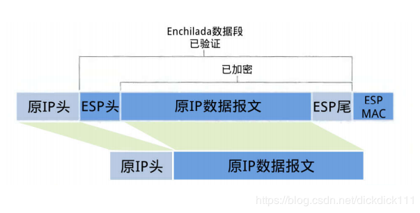

# IPSec传输模式下ESP报文的装包与拆包过程

- 姓名：张淇
- 学号：17343153
- 邮箱：zhangq295@mail2.sysu.edu.cn

## 一、IPSec 传输模式
1. IPSec: Internet Protocol Security 
   > IPSec是一种安全的网络协议套件，可对通过Internet协议网络发送的数据包进行身份验证和加密，它用于虚拟专用网络（VPN）。
   IPsec 对数据进行加密的方式有两种：传输模式和隧道模式。

2. 传输模式：
   > 传输模式只是对 IP 协议报文的有效数据载荷 (payload) 进行了加密，因此需要对原始 IP 报文进行拆装。
   在传输模式下，通常仅加密或认证IP数据包的有效负载。 路由是完整的，因为IP标头既未修改也不加密。 但是，使用身份验证头时，不能通过网络地址转换来修改IP地址，因为这总是使哈希值无效。 传输层和应用层始终由散列保护，因此不能以任何方式修改它们，例如，通过转换端口号。

## 二、 ESP报文
1. ESP: Encapsulating Security Payload
   
> ESP是IPSec中的一种协议，用于提供IPv4和IPv6网络中网络数据包数据/有效载荷的身份验证，完整性和机密性。传输模式下 ESP 不对整个原始 IP 报文加密，而只加密其中不包括 IP 头的有效载荷部分。
   
2. ESP数据包：
   >下图数传输模式下的ESP的数据包：
   
   IPSec在传输模式下采用原来的IP头，而不是产生新的IP头，所保护的也只是真正传输的数据，而不是整个IP报文。
   
   >与原始报文相比，新增的内容包括ESP头，ESP尾，ESP MAC这三部分
   (1) ESP尾：包含三部分：Padding，Pad length 和 Next header。Padding 即使用块加密时，当最后一个数据块长度不足时所做的填充。Pad length 指填充的长度，方便拆包时找到用来填充的数据段。Next header 标明被封装的数据报文的协议类型，如TCP。
   (2)ESP头：包含两部分：SPI和Seq。SPI占32位，用于将 AH 数据报文与相应的 SA 做映射。Seq占32位，存放了一个递增的计数值，用于抵抗重放攻击。该字段是强制要求使用的，无论是否启用了反重放攻击的功能。当 SA 建立时置为0。
   (3)ESP MAC：一个32位整数倍的完整性度量值 (MAC)，附在 ESP 报文的尾部。这是对于"Enchilada"部分做认证所产生的，用来进行完整性度量结果。

3. 装包过程:
   > (1)在原IP报文尾部添加ESP尾来指明填充块以及填充长度。
   (2)将(1)所得到的内容做加密算法（具体的加密算法与密钥是由SA给出）。
   (3)将(2)所得到的密文添加ESP头，目的是用作认证，用于抵抗重放攻击。
   (4)将(3)得到的结果附加上完整性度量结果。即对其做摘要，将ICV附在 ESP 报文的尾部,用于进行完整性度量结果。
   (5)将原始的IP报文头部的协议号改为50(50代表ESP协议),然后将该IP头添加到(4)的结果中形成IPSec报文。

4. 拆包过程
   > (1)接受方收到数据包首先发现协议的类型为50，由此得知这是IPSec数据包。接着查看ESP头，通过里面的SPI，通过 SPI 决定数据报文所对应的 SA.
   (2)计算“Enchilada"部分的摘要，然后用计算结果与末尾的ESP MAC来进行对比，如果一样，则完成完整性验证，表明所收到的报文是完整的。
   (3)检查ESP头中的Seq字段，检查是否已经收到过该序列号，以此避免重放攻击。
   (4)根据SA中指定的加密算法与密钥来解密"Enchilada"，得到原来IP报文和ESP尾。
   (5)根据ESP尾部的填充长度字段，来删除填充字段，这样就得到原来的IP报文。
   (6)最后根据原来IP报文的目的地址来进行转发。

